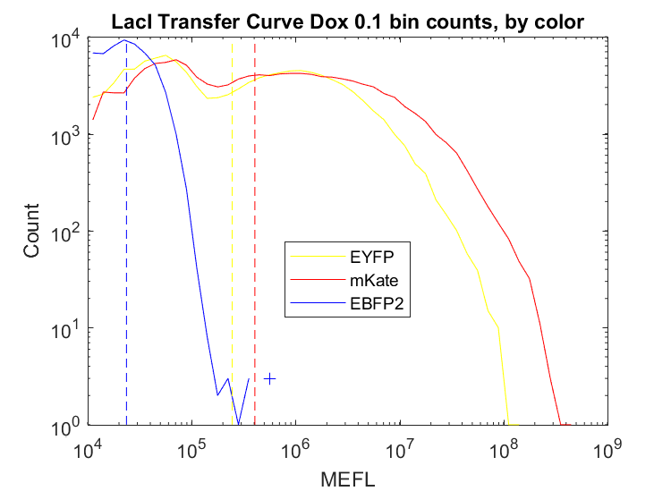
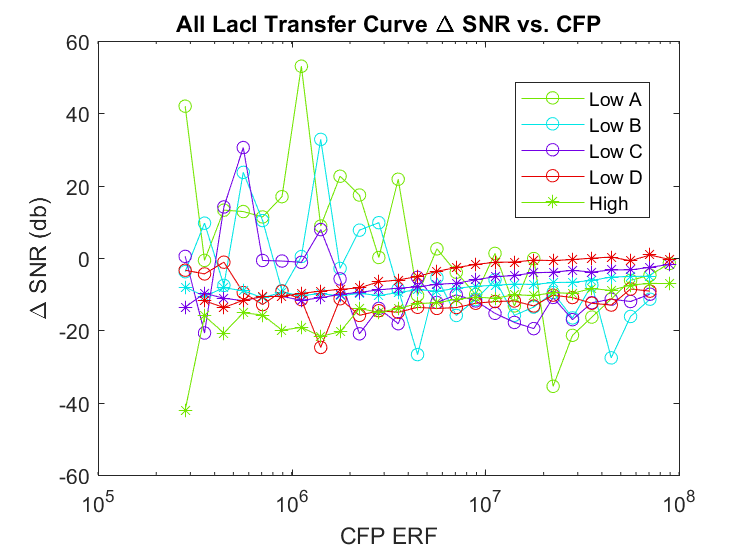
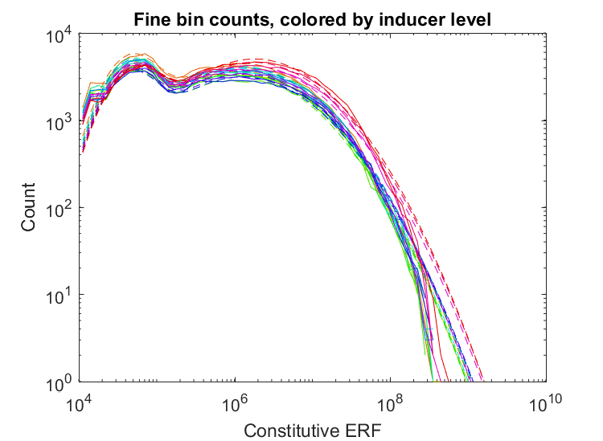

# Running Analysis 

 The three most common analyses include batch analysis, comparative analysis (also known as plusminus analysis), and transfer curve analysis. All three of these analyses can be executed using the [Excel Interface](docs/Excel_README.md) or tutorial [Matlab scripts](https://github.com/TASBE/TASBEFlowAnalytics-Tutorial/tree/master/template_analysis).

## Batch Analysis
 Batch analysis is the most basic analysis. It analyzes sets of replicates independently, outputting statistic files (containing geometric means and standard deviations) and graphs of bin counts for each channel in each sample.

 

## Comparative Analysis
 Comparative analysis compares data between various experimental conditions (i.e plus, minus). It plots these comparisons using many different methods, including ratios and fraction of cells active. 

 

## Transfer Curve Analysis
 Transfer curves are created by varying an input and comparing it to an output. Transfer curve analysis plots transfer curves with numeric inducer values on the x-axis and input/output fluorescence on the y-axis.

 

#### If any issues are encountered during the installation process, report them using the <a href="https://github.com/TASBE/TASBEFlowAnalytics/issues">Github Issue Tracker</a>.